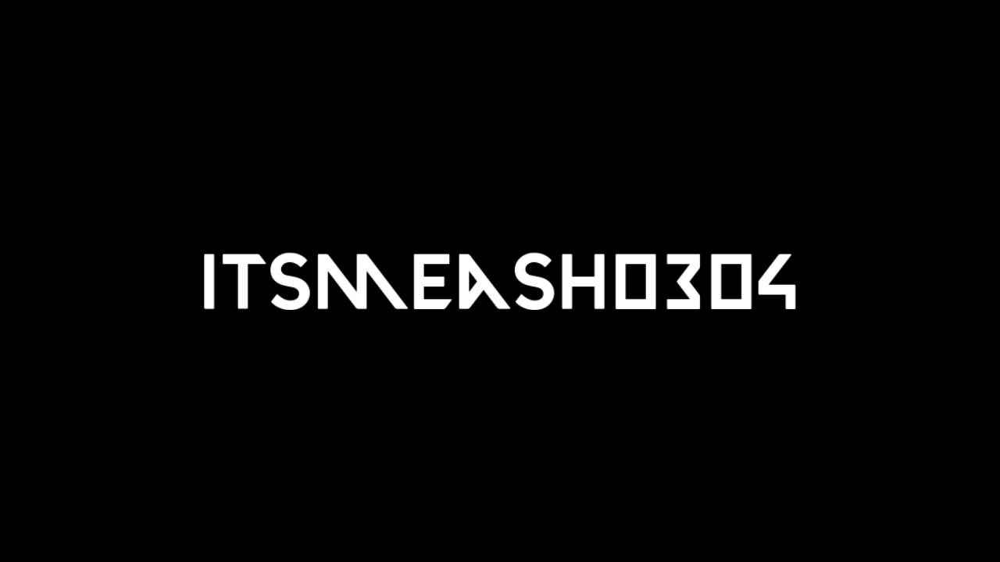

# Image to Audio Waveform

This Python script converts a black-and-white image of a waveform into a `.wav` audio file. It works by analyzing the pixel data of an input image, smoothing the waveform, and then generating a sound file based on the refined shape.

---

## Features

* **Image to Audio:** Convert a static image representation of a waveform into an audible sound file.
* **Waveform Smoothing:** Applies a moving average filter to the waveform to remove noise and create a cleaner audio output.
* **Customizable Duration:** Set the desired duration of the output audio in seconds.
* **Loss Calculation:** Calculates and displays the amount of data "lost" or removed during the smoothing process, giving you an idea of the fidelity between the original and processed waveforms.

---

## How It Works

The script operates on a black-and-white `.png` image to extract the waveform data. It identifies all black pixels `(0, 0, 0)` on the image and uses their Y-coordinates to define the wave's shape.

The process involves these steps:

1.  **Extraction:** The script reads the `ogWave.png` file and extracts the Y-coordinates of all black pixels.
2.  **Normalization:** The extracted coordinates are normalized to a value between -1 and 1, preparing them for audio output.
3.  **Smoothing:** A moving average filter is applied to the normalized values to create a smoother, more continuous waveform.
4.  **Loss Calculation:** The difference between the original and smoothed waveform is calculated and presented as a "loss" value, representing the amount of detail removed.
5.  **Audio Generation:** The smoothed waveform is used to generate an audio file with a sample rate equal to the number of data points, stretched to the specified duration.

---

## Installation

Before running the script, you need to install the required Python libraries.

```bash
pip install Pillow soundfile
```

## Usage

1.  **Prepare your input image:** Create a black and white image of your desired waveform. The image **must be named `ogWave.png`** and placed in the project folder. Example can be found in the repository.
2.  **Run the script:** Open your terminal or command prompt, navigate to the folder containing `sound.py` and run the script.
3.  **Enter the parameters:** The script will prompt you for three inputs:
    * **Folder path:** The relative path to the folder containing `ogWave.png`.
    * **Averaging window:** An integer that determines the size of the moving average filter. A higher value results in a smoother wave and more loss.
    * **Duration:** The desired length of the output audio file in seconds.

### Example

```bash
python sound.py
Folder path: ./sound1
Averaging window: 5
Duration: 10
```

## Connect with Me

* **GitHub:** [its-meAsh](https://github.com/its-meAsh)
* **Instagram:** [@itsmeash0405](https://www.instagram.com/itsmeash0405)
* **Gmail:** itsmeash0405@gmail.com
